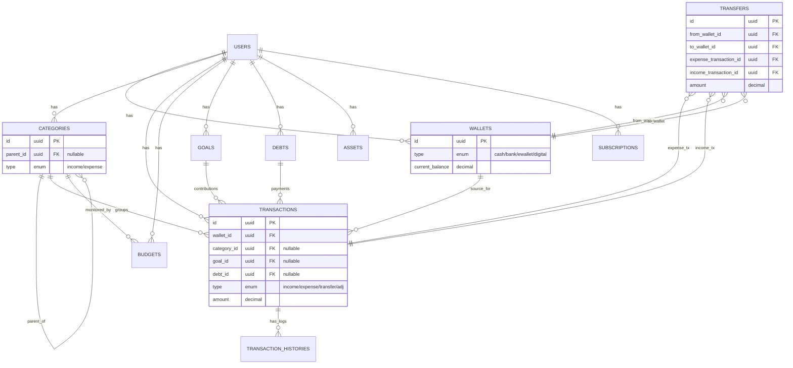

# 06. Entity Relationship Diagram (Visual)

Diagram di bawah ini menggambarkan relasi antar entitas utama secara komprehensif, berdasarkan spesifikasi skema di dokumen-dokumen sebelumnya.

```mermaid
erDiagram
    USERS ||--o{ WALLETS : "has"
    USERS ||--o{ CATEGORIES : "has"
    USERS ||--o{ TRANSACTIONS : "has"
    USERS ||--o{ BUDGETS : "has"
    USERS ||--o{ GOALS : "has"
    USERS ||--o{ DEBTS : "has"
    USERS ||--o{ ASSETS : "has"
    USERS ||--o{ SUBSCRIPTIONS : "has"

    WALLETS ||--o{ TRANSACTIONS : "source_for"
    
    CATEGORIES ||--o{ CATEGORIES : "parent_of"
    CATEGORIES ||--o{ TRANSACTIONS : "groups"
    CATEGORIES ||--o{ BUDGETS : "monitored_by"
    
    GOALS ||--o{ TRANSACTIONS : "contributions"
    
    DEBTS ||--o{ TRANSACTIONS : "payments"
    
    TRANSACTIONS ||--o{ TRANSACTION_HISTORIES : "has_logs"

    TRANSFERS }o--|| TRANSACTIONS : "expense_tx"
    TRANSFERS }o--|| TRANSACTIONS : "income_tx"
    TRANSFERS }o--|| WALLETS : "from_wallet"
    TRANSFERS }o--|| WALLETS : "to_wallet"

    %% Key Entity Details
    TRANSACTIONS {
        id uuid PK
        wallet_id uuid FK
        category_id uuid FK "nullable"
        goal_id uuid FK "nullable"
        debt_id uuid FK "nullable"
        type enum "income/expense/transfer/adj"
        amount decimal
    }

    WALLETS {
        id uuid PK
        type enum "cash/bank/ewallet/digital"
        current_balance decimal
    }

    CATEGORIES {
        id uuid PK
        parent_id uuid FK "nullable"
        type enum "income/expense"
    }

    TRANSFERS {
        id uuid PK
        from_wallet_id uuid FK
        to_wallet_id uuid FK
        expense_transaction_id uuid FK
        income_transaction_id uuid FK
        amount decimal
    }
```
