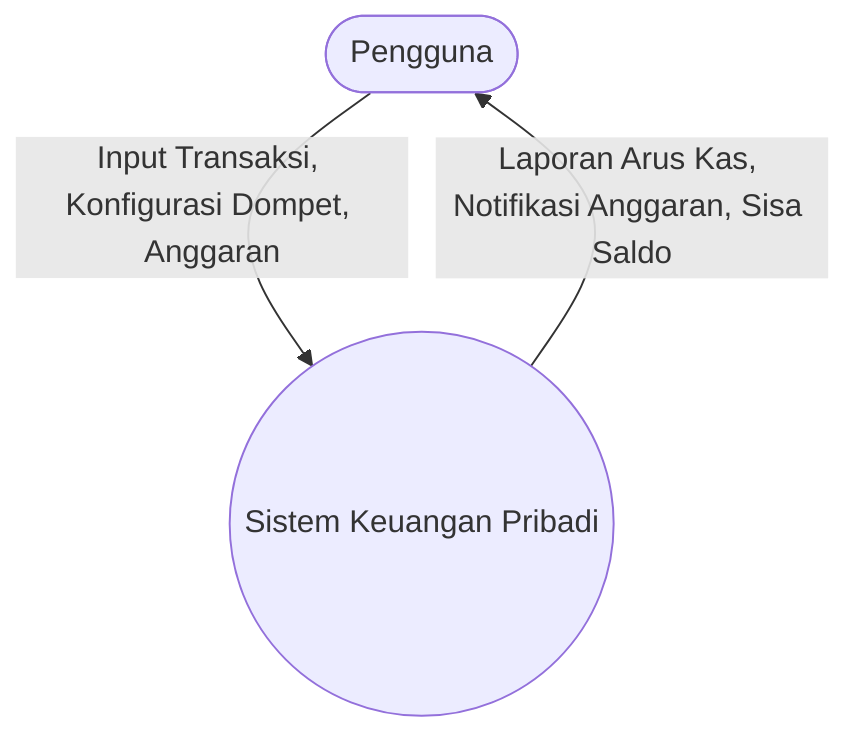
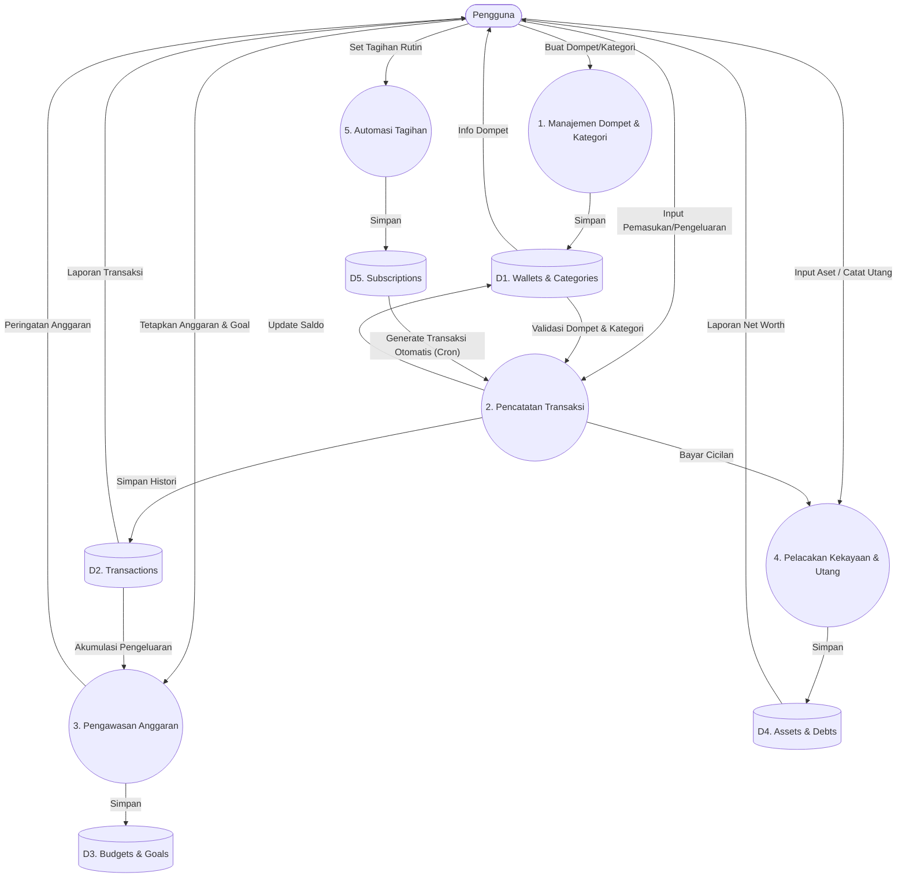

# 07. Data Flow Diagram (DFD)

Dokumen ini memetakan bagaimana data mengalir di dalam sistem keuangan pribadi.

## Context Diagram (Level 0)

Diagram ini menunjukkan interaksi sistem dengan entitas eksternal (dalam hal ini, hanya Pengguna).

## DFD Level 1: Modul Utama

### Penjelasan:
1. **Manajemen Dompet**: Pintu masuk awal, mengatur saldo dan klasifikasi kategori.
2. **Pencatatan Transaksi**: Mengalirkan data nominal ke dompet (mengubah saldo) dan mencatatkan bukti historis di tabel transaksi.
3. **Pengawasan Anggaran**: Membaca agregasi dari tabel transaksi untuk membandingkan dengan batas *budget* yang ditetapkan.
4. **Automasi Tagihan**: Proses latar belakang (Cron job) yang membaca data *Subscriptions* dan memicu *Pencatatan Transaksi* secara otomatis di tanggal penagihan.
