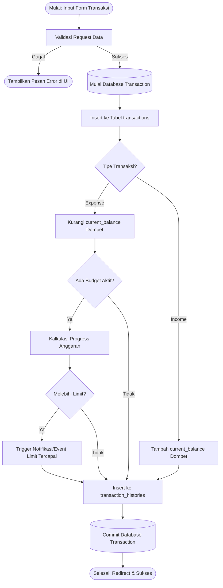
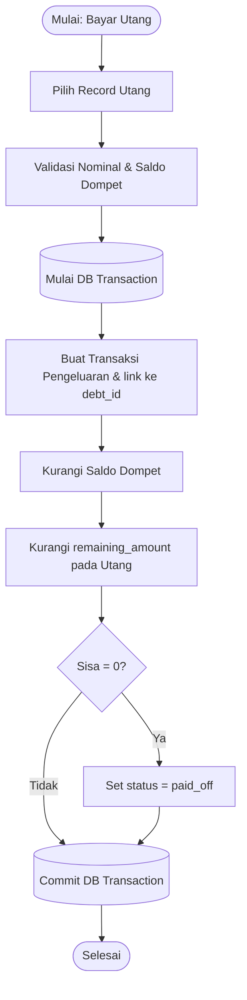

# 08. Business Process Flowcharts

Flowchart ini memetakan logika operasional di balik layar untuk proses-proses penting.

## 1. Alur Pembuatan Transaksi (Income/Expense)
Proses standar saat pengguna memasukkan pengeluaran atau pemasukan baru.



## 2. Alur Pembayaran Utang / Cicilan
Mencatat pengeluaran yang secara spesifik mengurangi sisa hutang.



## 3. Alur Automasi Subscriptions (Cron Job)
Cron job berjalan setiap hari di tengah malam untuk memproses tagihan berulang.

```mermaid
flowchart TD
    Start([Cron: Schedule Run Daily]) --> CariData[Query: Subscriptions where next_billing_date <= Hari Ini & is_active = true]
    CariData --> Loop[Loop Setiap Data Tagihan]
    
    Loop --> CreateTx[Buat Transaksi Pengeluaran Otomatis (via Action Class)]
    CreateTx --> UpdateWallet[Kurangi Saldo Dompet]
    
    UpdateWallet --> UpdateNextDate[Hitung & Set next_billing_date (Bulan/Tahun Depan)]
    UpdateNextDate --> Notifikasi[Kirim Notifikasi 'Tagihan Terpotong']
    Notifikasi --> CekSisaData{Masih ada data?}
    
    CekSisaData -- Ya --> Loop
    CekSisaData -- Tidak --> End([Selesai])
```
